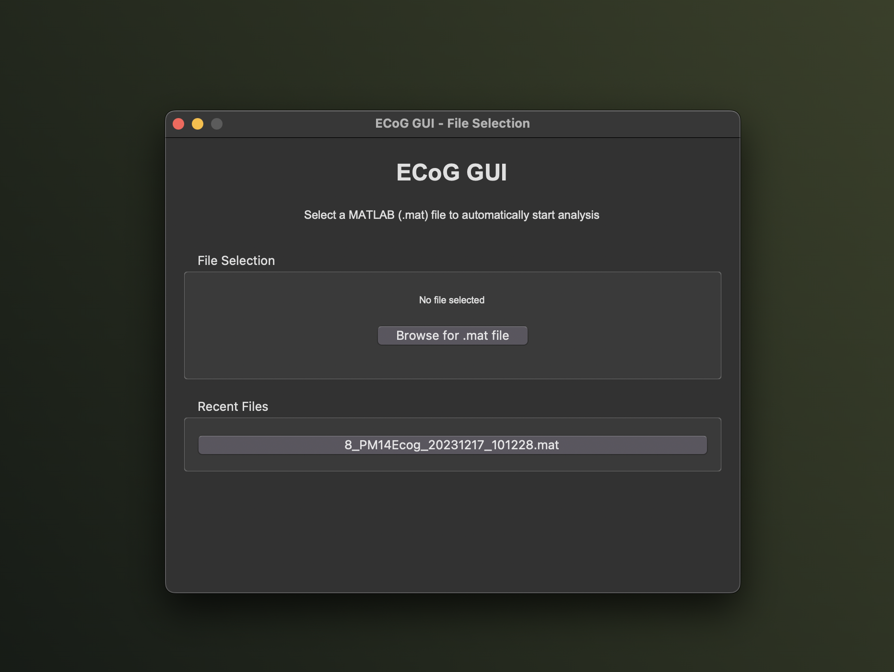
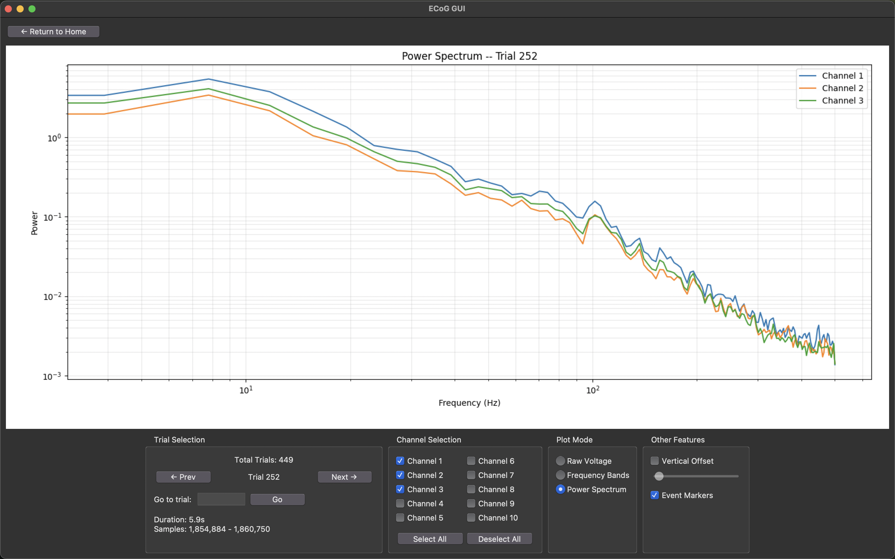
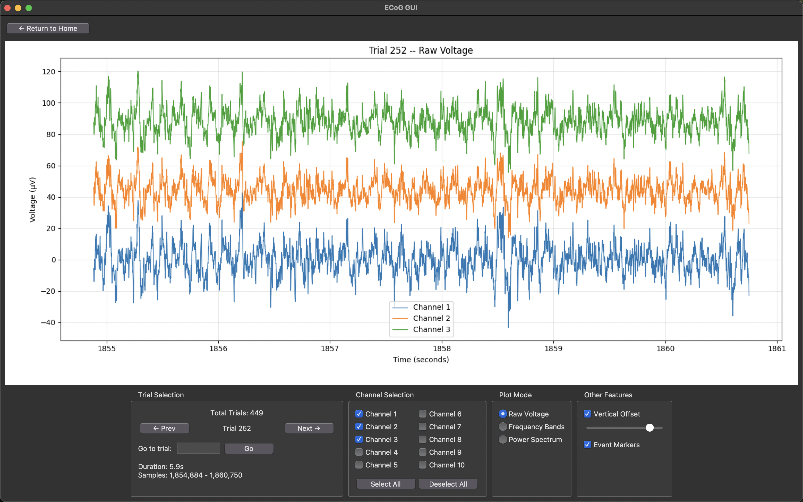

# ECoG GUI - Neural Data Visualization Tool

A Python-based GUI application for visualizing ECoG (Electrocorticography) data with lick and reward event markers. This tool allows researchers to browse through neural recordings, view raw voltage and frequency band data, and correlate neural activity with behavioral events.

## Screenshots







## Features

- **Multi-channel ECoG visualization**: View raw voltage and frequency band data from up to 10 channels
- **Trial-based navigation**: Browse through experimental trials with easy navigation controls
- **Behavioral event markers**: Visualize lick and reward events overlaid on neural data
- **Flexible time windows**: Adjust viewing window from 2 to 20 seconds
- **Channel selection**: Select/deselect individual channels or use bulk selection
- **Multiple plot modes**: Raw voltage, frequency bands, and power spectrum visualization
- **MATLAB file support**: Direct loading of .mat files with automatic data structure detection

## Quick Start

### Prerequisites

- Python 3.8 or higher
- pip (Python package installer)

### Installation

#### Option 1: Automated Installation (Recommended)

**macOS/Linux:**
```bash
chmod +x install.sh
./install.sh
```

**Windows:**
```bash
install.bat
```

#### Option 2: Manual Installation

1. **Create virtual environment:**
   ```bash
   python3 -m venv .venv
   source .venv/bin/activate  # macOS/Linux
   # or .venv\Scripts\activate  # Windows
   ```

2. **Install dependencies:**
   ```bash
   pip install -r requirements.txt
   ```

### Running the Application

```bash
# Activate virtual environment (if not already active)
source .venv/bin/activate  # macOS/Linux
# or .venv\Scripts\activate  # Windows

# Run the GUI
python3 GUI.py
```

### Data Preparation

Place your MATLAB (.mat) files in the `Data/` folder. The application expects MATLAB files with the following structure:

```
data/
├── ECoG/
│   ├── rawVoltage (samples × channels)
│   └── frequencyBands (samples × bands × channels)
├── Events/
│   ├── trialStart (trial start markers)
│   ├── licks (lick event markers)
│   └── reward (reward event markers)
├── Metadata/
│   └── samplingRate
└── bhv/ (behavioral data)
```

## Usage

### Starting the Application

```bash
python3 GUI.py
```

### Basic Navigation

1. **File Selection**: The application will automatically load the default file or prompt you to select a .mat file
2. **Trial Navigation**: Use the "← Prev" and "Next →" buttons or arrow keys to navigate between trials
3. **Channel Selection**: Check/uncheck channels in the Channel Selection panel
4. **Plot Mode**: Choose between "Raw Voltage", "Frequency Bands", or "Power Spectrum"
5. **Time Window**: Adjust the viewing window (2, 5, 10, or 20 seconds)

### Understanding the Display

- **Blue triangles (▼)**: Lick events
- **Red triangles (▲)**: Reward events
- **Green dots**: Trial start markers
- **Colored lines**: Neural data from different channels

### Quick Tips

- Use "Select All" and "Deselect All" buttons for quick channel management
- Navigate to specific trials using the "Go to trial" input field
- Switch between plot modes to focus on different aspects of the data
- Adjust time windows to see more or less detail

## Data Analysis Tools

### MATLAB File Analysis

Use the included analysis tool to explore new MATLAB files:

```bash
python3 ANALYZE_MAT.py [filename.mat]
```

This tool provides detailed information about:
- Data structure and dimensions
- Available events and their counts
- Metadata and sampling information
- Behavioral data summary

## File Structure

```
Feldman_GUI/
├── GUI.py                    # Main ECoG GUI application
├── ANALYZE_MAT.py            # MATLAB file analysis tool
├── Data/                     # Data folder for MATLAB files
│   └── 8_PM14Ecog_20231217_101228.mat
├── requirements.txt          # Python dependencies
├── README.md                # This file
└── .gitignore               # Git ignore rules
```

## Troubleshooting

### Common Issues

1. **"No module named 'h5py'"**: Install dependencies with `pip install -r requirements.txt`
2. **"File not found"**: Ensure your .mat file is in the `Data/` folder
3. **"Invalid data structure"**: Use `ANALYZE_MAT.py` to check your file format
4. **GUI not responding**: Check that your virtual environment is activated

### Data Format Requirements

Your MATLAB file must contain:
- `data.ECoG.rawVoltage`: Neural voltage data
- `data.Events.trialStart`: Trial start markers
- `data.Events.licks`: Lick event markers (optional)
- `data.Events.reward`: Reward event markers (optional)

## Contributing

1. Fork the repository
2. Create a feature branch (`git checkout -b feature/AmazingFeature`)
3. Commit your changes (`git commit -m 'Add some AmazingFeature'`)
4. Push to the branch (`git push origin feature/AmazingFeature`)
5. Open a Pull Request

## License

This project is licensed under the MIT License - see the LICENSE file for details.

## Acknowledgments

- Built for neuroscience research applications
- Designed for ECoG data analysis workflows
- Supports behavioral correlation analysis

## Support

For issues and questions:
1. Check the troubleshooting section above
2. Use `ANALYZE_MAT.py` to verify your data format
3. Open an issue on GitHub with detailed error information

---

**Note**: This tool is designed for research purposes. Ensure your data handling complies with relevant institutional and ethical guidelines.
